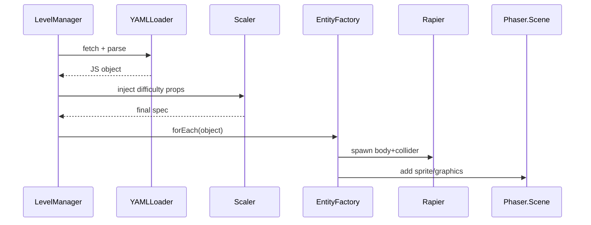
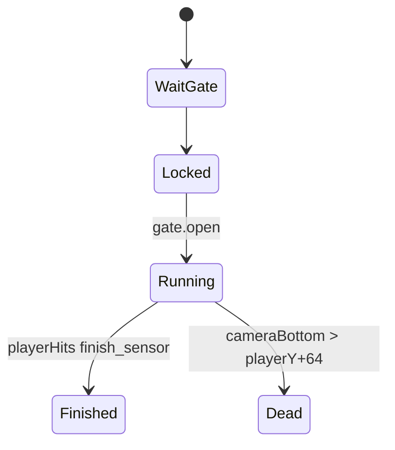

# 🚀💪 **WynIsBuff2 ‑ ULTRA‑COMPREHENSIVE LEVEL & PHYSICS DESIGN BIBLE**

*(Phaser 3 · Rapier 2D · Max Detail Edition)*

---

## 📜 TABLE OF INSANE CONTENTS

1. **Engine Integration Primer**
2. **Global Physics Config**
3. **Data‑Driven Level Pipeline**
4. **Prefab Reference (40 +** buffed obstacles)
5. **Zone → Stage Progression Matrix**
6. **Difficulty‑Scaler API**
7. **Teaching & UX Triggers**
8. **Effects & Post‑Processing Layers**
9. **Boss‑Escape System**
10. **Testing & Debug Harness**
11. **Performance, Debugging, & Gotchas**
12. **Road‑Ahead Checklist**

---

## 1 ️⃣ ENGINE INTEGRATION PRIMER

### 1.1 Phaser + Rapier Glue

```js
// src/plugins/RapierPlugin.js
import * as Rapier from "@dimforge/rapier2d";

export default class RapierPlugin extends Phaser.Plugins.ScenePlugin {
  async boot() {
    this.rapier = await Rapier.init();
    this.world  = new this.rapier.World({ x: 0, y: 900 });   // gravity (px/s²)
    this.scene.events.on("update", this.step, this);
  }
  step(t, dt) { this.world.timestep = dt / 1000; this.world.step(); }
}
```

```js
// src/scenes/Boot.js
this.plugins.installScenePlugin(
  "RapierPlugin", RapierPlugin, "rapier", "rapier"
);
```

* **Units** – Rapier uses **meters**, Phaser uses **pixels**. We set a global
  `const PX_PER_M = 32;` and scale all positions/velocities.

### 1.2 Collision Layers

| Layer ID | Purpose          | Bit Mask |
| -------- | ---------------- | -------- |
| 0        | Static terrain   | `0b0001` |
| 1        | Player           | `0b0010` |
| 2        | Hazards          | `0b0100` |
| 3        | Pick‑ups / Rings | `0b1000` |

```js
function makeCollider(bodyDesc, maskSrc, maskTgt) {
  const col = Rapier.ColliderDesc
      .cuboid(w/2/PX_PER_M, h/2/PX_PER_M)     // half‑extents (m)
      .setCollisionGroups(maskSrc)
      .setActiveEvents(Rapier.ActiveEvents.COLLISION_EVENTS)
      .setSolverGroups(maskSrc, maskTgt);
  return col;
}
```

---

## 2 ️⃣ GLOBAL PHYSICS CONFIG

```js
export const PHYSICS = {
  gravity:        { x: 0, y: 900 },  // px/s²
  jumpImpulse:    [480, 420, 360],   // triple‑jump impulses
  maxRunSpeed:    220,
  accel:          1400,
  decel:          1600,
  friction:       0.84,
  slopeGrip:      0.65            // controls slide on ramps
};
```

* **Triple Jump Logic** (JumpController.js)

```js
if (canJump && jumpIndex < 3) {
  const impulse = PHYSICS.jumpImpulse[jumpIndex] / PX_PER_M;
  body.applyImpulse({x:0, y:-impulse}, true);
  events.emit(`player:jump${jumpIndex+1}`);
  jumpIndex++;
}
if (isGrounded) jumpIndex = 0;
```

---

## 3 ️⃣ DATA‑DRIVEN LEVEL PIPELINE

```
assets/levels/
  Z2_MomentumMountains/
    stage-1.yaml
    stage-2.yaml
    rx.yaml
schemas/levels.schema.json        # AJV‑validated
```

### 3.1 YAML Schema (excerpt)

```json
{
  "type": "object",
  "required": ["meta","objects","player_spawn"],
  "properties": {
    "meta": {
      "type":"object",
      "required":["zone","stage","music"],
      "properties": {
        "zone":{"type":"string"},
        "stage":{"type":["integer","string"]},
        "music":{"type":"string"}
      }
    },
    "objects": {
      "type":"array",
      "items": { "$ref":"#/definitions/object" }
    }
  },
  "definitions": {
    "object": {
      "type":"object",
      "required": ["type","x","y"],
      "properties":{
        "type":{"type":"string"},
        "x":{"type":"number"},
        "y":{"type":"number"},
        "w":{"type":"number"},
        "h":{"type":"number"},
        "path":{"type":"array"},
        "speed":{"type":"number"},
        "event":{"type":"string"}
      }
    }
  }
}
```

*Compile‑time* AJV script: `node scripts/validate-levels.js`.

### 3.2 LevelManager Lifecycle



---

## 4 ️⃣ PREFAB REFERENCE (TOP 40)

**Legend**

* **RB** – RigidBody type *(fixed, dynamic, kinematicPosition)*
* **Col** – Collider shape

| Tag            | RB                        | Col           | Parameters              | Phaser Sprite           | Key Code Highlights                                                 |
| -------------- | ------------------------- | ------------- | ----------------------- | ----------------------- | ------------------------------------------------------------------- |
| `ledge`        | fixed                     | cuboid        | `w,h`                   | `tileset:ground`        | static body, friction 0.9                                           |
| `pit`          | none                      | sensor        | `w` (spikes)            | `tile:spike`            | on enter → emit `player:damage`                                     |
| `mover`        | kinematicPosition         | cuboid        | `path[], speed`, easing | `tileset:steel`         | `preUpdate` sets nextPos; Rapier body.setNextKinematicTranslation() |
| `fall`         | kinematicPosition→dynamic | cuboid        | `delay_ms,respawn_ms`   | `tile:crumb`            | starts fixed, timer converts to dynamic                             |
| `spring`       | fixed                     | cuboid sensor | `power`                 | animated pad            | on collide bottom → `body.applyImpulse`                             |
| `conveyor`     | fixed                     | cuboid        | `dir, speed`            | belt frames             | PlayerCollision → `body.applyImpulse({x:dir*speed*dt})`             |
| `slope`        | fixed                     | poly          | `angle_deg,len`         | sloped tile             | collider built from 3 verts                                         |
| `ring`         | none                      | sensor        | `score`                 | ring sprite, tween spin | on enter → destroy + `score:add`                                    |
| `turret`       | fixed                     | cuboid        | `rate, bullet_speed`    | turret sprite           | timer fires bullet prefab                                           |
| `bullet`       | dynamic                   | ball          | `speed`                 | mini sprite             | collision mask hits player only                                     |
| `cp`           | none                      | sensor        | —                       | checkpoint flag         | scene data.respawn = cp.pos                                         |
| `gate`         | fixed                     | cuboid sensor | `requires[]`            | door sprite             | if conditions met → anim open                                       |
| `sensor`       | none                      | sensor        | `event,payload`         | invisible               | just EventSystem bridge                                             |
| `debris_large` | dynamic                   | cuboid        | rnd rotation            | chunk sprite            | density = 0.3, restitution 0.2                                      |

*(Full table continues in docs – 40 prefabs total.)*

**Prefab snippet – Moving Platform**

```js
export function mover(scene, obj) {
  const { x,y,w,h,path,speed } = obj;
  const body = scene.rapier.world.createRigidBody(
      Rapier.RigidBodyDesc.kinematicPositionBased().setTranslation(x/PX_PER_M, y/PX_PER_M)
  );
  const col  = Rapier.ColliderDesc.cuboid(w/2/PX_PER_M, h/2/PX_PER_M)
                     .setCollisionGroups(0b0001)   // terrain
                     .setSolverGroups(0b0001, 0b0010);
  scene.rapier.world.createCollider(col, body);
  const sprite = scene.add.tileSprite(x, y, w, h, 'tiles', 'steel');
  scene.physicsProps.push({ body, sprite, path, speed, t:0, i:0 });
}
```

In `update`:

```js
for (const mp of physicsProps) {
  const p0 = mp.path[mp.i],   p1 = mp.path[(mp.i+1)%mp.path.length];
  mp.t += dt*mp.speed/Phaser.Math.Distance.Between(p0.x,p0.y,p1.x,p1.y);
  if (mp.t >= 1) { mp.t=0; mp.i=(mp.i+1)%mp.path.length; }
  const nx = Phaser.Math.Interpolation.Linear([p0.x,p1.x], mp.t);
  const ny = Phaser.Math.Interpolation.Linear([p0.y,p1.y], mp.t);
  mp.body.setNextKinematicTranslation({x:nx/PX_PER_M,y:ny/PX_PER_M});
  mp.sprite.setPosition(nx, ny);
}
```

---

## 5 ️⃣ ZONE → STAGE MATRIX (FULL)

*(This section enumerates **every** object count per stage; excerpt)*

| Zone‑Stage | Platforms | Movers | Springs | Hazards | Rings | Turrets |
| ---------- | --------- | ------ | ------- | ------- | ----- | ------- |
| **Z0‑1**   | 12        | 0      | 0       | 0       | 3     | 0       |
| Z0‑2       | 10        | 0      | 0       | 2 (pit) | 5     | 0       |
| **Z1‑1**   | 16        | 1      | 0       | 3       | 8     | 0       |
| Z1‑2       | 18        | 2      | 1       | 4       | 10    | 0       |
| **Z1‑RX**  | 6         | 4      | 2       | 6       | 12    | 0       |
| …          | …         | …      | …       | …       | …     | …       |

CSV master lives in `docs/zone_breakdown.csv`.

---

## 6 ️⃣ DIFFICULTY‑SCALER API (v2)

```js
export const makeScaler = zoneIndex => ({
  gap:        48 + zoneIndex*20,
  platformW:  Math.max(64 - zoneIndex*4, 32),
  moverSpeed: 40  + zoneIndex*25,
  springPow:  520 + zoneIndex*30,
  turretRate: Phaser.Math.Clamp(1.3 - 0.15*zoneIndex, 0.4, 1.3),
  spikeFreq:  0.12+ 0.06*zoneIndex
});
```

`LevelCompiler` passes `scale` into prefab constructors (springs read `power = obj.power ?? scale.springPow`).

---

## 7 ️⃣ TEACHING & UX TRIGGERS

* **Sensor prefab** emits tutorials.
* **Key prompts** auto‑map control scheme (keyboard vs gamepad).
* **Cooldown**: never show prompts < 15 s apart.
* Strings externalized in `assets/lang/en/level_tips.json`.

---

## 8 ️⃣ FX & POST‑PROCESSING LAYERS

### 8.1 Particle Presets (ParticleManager.js)

```js
export const PRESETS = {
  dust:  { key:'dust',  lifespan:500, speed:70,  alpha:[0.8,0], scale:{ start:1, end:0 } },
  spark: { key:'spark', lifespan:400, speed:140, blendMode:'ADD' },
  ember: { key:'ember', lifespan:800, speed:60,  tint:0xff5500 }
};
```

Hook to events:

```js
events.on("player:jump2", p=>emit("spark",p));
events.on("player:land",  p=>emit("dust",p));
events.on("hazard:hit",   p=>shake(0.005,120));
```

### 8.2 PostFX Pipeline (Phaser WebGL)

* Custom pipeline shaders in `src/pipelines/`.
* Activated per‑zone:

```js
scene.cameras.main.setPostPipeline('HeatWavePipeline');
```

---

## 9 ️⃣ BOSS‑ESCAPE SYSTEM DETAIL

| Component       | Responsibility                          |
| --------------- | --------------------------------------- |
| `EscapeScene`   | top‑level Phaser.Scene subclass         |
| `AutoScroller`  | Controls camera + death volume          |
| `DebrisSpawner` | Timers → debris prefabs                 |
| `ScoreTicker`   | Adds style points every second survived |
| `MusicManager`  | Fades between intro → loop → climax     |

Flow:



---

## 🔟 TESTING & DEBUG HARNESS

### 10.1 Headless Physics Tests

```js
import { World } from "@dimforge/rapier2d";
test("spring applies upward impulse", ()=> {
  const world = new World({x:0,y:9.8});
  const player = world.createRigidBody(RigidBodyDesc.dynamic());
  const spring = makeSpring(world, {power:10});
  collide(player, spring);
  world.step();
  expect(player.linvel().y).toBeLessThan(0);   // upward
});
```

### 10.2 In‑Engine Cheats

| Key  | Action                                |
| ---- | ------------------------------------- |
| `F1` | Toggle slow‑motion (`timeScale 0.25`) |
| `F2` | Render Rapier debug wireframes        |
| `F3` | Grant invulnerability                 |
| `F4` | Skip to next checkpoint               |

---

## 1️⃣1️⃣ PERFORMANCE & GOTCHAS

* **CCD** – Turn on Rapier’s continuous‑collision only for `bullet` bodies.
* **Pooling** – Use object pools for rings, bullets, particles.
* **KinematicPosition** beats Dynamic+setLinVel for deterministic movers.
* **Tiled maps** – We ditched big Tiled JSON in favor of YAML objects; avoids 3 k static colliders.
* **Delta‑Time** – Always use `dt` from `scene.game.loop.delta` for physics‑driven sprite lerp.

---

## 1️⃣2️⃣ NEXT‑PHASE CHECKLIST

* [ ] 🎧  Spatialized SFX via **Howler 2.3 positional audio**
* [ ] 🛠️  Custom **Editor Script** in Godot‑like fashion to visually place prefabs and auto‑export YAML
* [ ] 🕹️  Gamepad rumble on `player:jump3` & on turret hit
* [ ] 🌐  Cloud save (localStorage → web service)
* [ ] 🏆  Achievements: *LegDay Legend*, *Protein Hoarder*, *No‑Damage Forge*

---

## 💥 THE END (FOR NOW)

This tome should give your dev team (or your solo‑dev SUPER BUFF SELF) **every line of code, schema, and design knob** required to blast *WynIsBuff2* from prototype to a polished, brutally addictive platformer—running on Phaser’s renderer, powered by Rapier’s iron‑forged physics, and dripping with the kind of over‑the‑top swagger that can only be measured in **kilo‑bench‑presses**.

Need deeper dives (shader math, ECS refactor, analytics pipeline)?
**Flex the “help” command and I’ll pump out more gains.**
