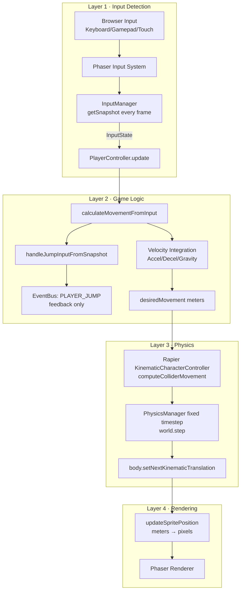
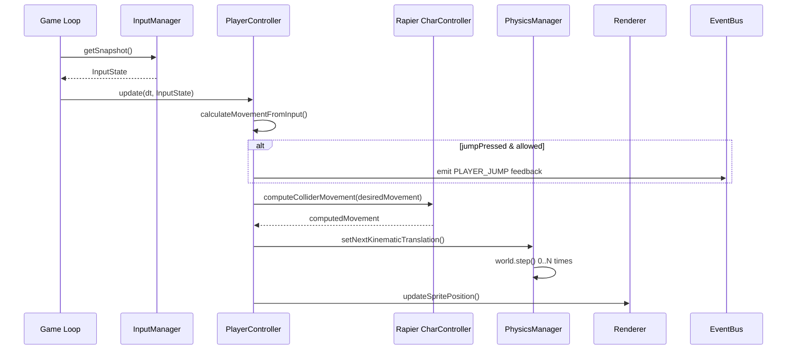

# WynIsBuff2 - Input & Movement System Audit

**Document Version**: 2.0
**Last Updated**: 2025-10-29
**Status**: ✅ **FUNCTIONAL** - Modern InputState Snapshot Architecture

---

## Executive Summary

This document provides a comprehensive technical audit of WynIsBuff2's **modern snapshot-based input architecture**, tracing the complete data flow from physical keyboard input to on-screen physics-based motion. The system integrates **Phaser 3.90** (input/rendering), **Rapier 2D 0.19.2** (physics), and a clean **InputState snapshot pattern**.

**Current Architecture**: The system now uses an **InputState snapshot pattern** where InputManager creates immutable, frame-based input snapshots that PlayerController consumes as pure data. This architecture is:
- ✅ **Testable** (mock InputState for unit tests)
- ✅ **Deterministic** (single source of truth per frame)
- ✅ **Multi-input ready** (keyboard, gamepad, touch)
- ✅ **Replay-able** (record/playback for debugging)

**Critical Bug Fixed**: Ducking collider now correctly uses **METERS** instead of PIXELS (was causing physics explosions)

---

## Table of Contents

1. [System Architecture Overview](#1-system-architecture-overview)
2. [Input Registration and Mapping](#2-input-registration-and-mapping)
3. [Event Emission Logic](#3-event-emission-logic)
4. [Event Listening and State Management](#4-event-listening-and-state-management)
5. [Physics Execution (Rapier Interface)](#5-physics-execution-rapier-interface)
6. [Complete Data Flow](#6-complete-data-flow)
7. [Critical Configuration](#7-critical-configuration)
8. [Known Issues and Debugging Notes](#8-known-issues-and-debugging-notes)
9. [File Reference Matrix](#9-file-reference-matrix)

---

## 1. System Architecture Overview (2025 - Snapshot Pattern)

### 🎯 Modern Architecture: InputState Snapshot Pattern

The system now follows a **clean data flow architecture** where input is captured as immutable snapshots:



### Per-Frame Data Flow



### Architectural Patterns

| Pattern | Usage | Purpose |
|---------|-------|---------|
| **InputState Snapshot** | `InputManager.getSnapshot()` | Immutable frame-based input data |
| **Pure Functions** | `calculateMovementFromInput(input, dt)` | Testable, deterministic movement |
| **Fixed Timestep** | Accumulator in `PhysicsManager` | Deterministic 60Hz physics |
| **Kinematic Character Controller** | Rapier's `CharacterController` | Manual position control with collision |
| **Units Separation** | Pixels for rendering, Meters for physics | Prevent physics explosions |

---

## 2. Input Registration and Mapping

### 2.1 InputManager Implementation

**File**: `src/core/InputManager.js`
**Class**: `InputManager extends BaseManager`
**Singleton**: Yes (via BaseManager pattern)

#### Key Methods

| Method | Lines | Purpose |
|--------|-------|---------|
| `constructor()` | 14-21 | Initialize singleton instance |
| `init(scene, eventSystem)` | 28-83 | Set up keyboard listeners and event bindings |
| `destroy()` | 88-100 | Clean up listeners on scene shutdown |

#### 2.2 Keyboard Input Registration

**Location**: `InputManager.init()` (Lines 28-83)

```javascript
// src/core/InputManager.js:31-44
const keyboard = scene.input.keyboard;

// Phaser's built-in cursor keys (Arrow keys)
this.keys.cursors = keyboard.createCursorKeys();

// Individual WASD + Space keys
['W', 'A', 'S', 'D', 'SPACE'].forEach(keyName => {
    this.keys[keyName] = keyboard.addKey(
        Phaser.Input.Keyboard.KeyCodes[keyName]
    );
});

// Additional keys
this.keys.C = keyboard.addKey('C');      // Duck
this.keys.R = keyboard.addKey('R');      // Reset
this.keys.ESC = keyboard.addKey('ESC');  // Pause
```

**Result**: Creates Phaser `Key` objects stored in `this.keys` for polling.

#### 2.3 Dynamic Keybinding System

**Location**: `InputManager.init()` (Lines 57-73)

```javascript
// Load player-configured keybindings from GameStateManager
const gs = new GameStateManager();
const bindings = gs.settings.keybindings;

// Map game actions to event names
const actionMap = {
    jump: EventNames.JUMP,
    left: EventNames.MOVE_LEFT,
    right: EventNames.MOVE_RIGHT,
    pause: EventNames.PAUSE,
    resetLevel: EventNames.LEVEL_RESET
};

// Bind each configured key to its action
Object.entries(actionMap).forEach(([action, eventName]) => {
    const keyCode = bindings[action];
    if (keyCode) {
        const key = keyboard.addKey(keyCode);
        key.on('down', () => this.eventSystem.emit(eventName));
    }
});
```

**Configuration Source**: `GameStateManager.settings.keybindings`

**Default Keybindings** (from GameStateManager):
```javascript
keybindings: {
    jump: 'SPACE',
    left: 'A',
    right: 'D',
    pause: 'ESC',
    resetLevel: 'R'
}
```

#### 2.4 Event-Driven Input (Currently Active)

**Location**: `InputManager.init()` (Lines 47-76)

```javascript
// Direct key event → EventBus emission
this.keys.cursors.left.on('down', () =>
    this.eventSystem.emit(EventNames.MOVE_LEFT)
);

this.keys.cursors.right.on('down', () =>
    this.eventSystem.emit(EventNames.MOVE_RIGHT)
);

this.keys.cursors.up.on('down', () =>
    this.eventSystem.emit(EventNames.MOVE_UP)
);

this.keys.cursors.down.on('down', () =>
    this.eventSystem.emit(EventNames.MOVE_DOWN)
);

this.keys.SPACE.on('down', () =>
    this.eventSystem.emit(EventNames.JUMP)
);

this.keys.C.on('down', () =>
    this.eventSystem.emit(EventNames.DUCK)
);

this.keys.R.on('down', () =>
    this.eventSystem.emit(EventNames.LEVEL_RESET)
);

this.keys.ESC.on('down', () =>
    this.eventSystem.emit(EventNames.PAUSE)
);
```

**⚠️ CRITICAL ISSUE**: Event-driven input only fires on key DOWN. Movement requires continuous polling of `isDown` state.

### 2.5 Input Constants

**File**: `src/constants/EventNames.js`

```javascript
// Lines 84-88: Input events
MOVE_LEFT: 'input:moveLeft',
MOVE_RIGHT: 'input:moveRight',
MOVE_UP: 'input:moveUp',
MOVE_DOWN: 'input:moveDown',
JUMP: 'input:jump',
```

**⚠️ OBSERVATION**: These events are emitted but **not currently used** by PlayerController. The controller directly polls `key.isDown` instead.

---

## 3. Event Emission Logic

### 3.1 EventBus Core

**File**: `src/core/EventBus.js`
**Implementation**: Singleton instance wrapping Phaser's `EventEmitter`

```javascript
// Lines 11-16: EventEmitter selection
const EventEmitterClass = typeof Phaser !== 'undefined' && Phaser.Events
    ? Phaser.Events.EventEmitter  // Use Phaser in browser
    : MiniEmitter;                // Fallback for Node.js tests

// Line 72: Export singleton
export const EventBus = new EventEmitterClass();
```

#### Key Methods

| Method | Lines | Signature | Purpose |
|--------|-------|-----------|---------|
| `on()` | 28-33 | `on(event, callback, context)` | Register event listener |
| `emit()` | 53-65 | `emit(event, ...args)` | Dispatch event with error handling |
| `off()` | 35-42 | `off(event, callback, context)` | Remove event listener |
| `once()` | 44-51 | `once(event, callback, context)` | Listen for single occurrence |

#### Error Handling

```javascript
// Lines 55-65: Safe event emission
emit(event, ...args) {
    try {
        if (this.debugMode) {
            console.log(`[EventBus] Emitting: ${event}`, args);
        }
        return this._events.emit(event, ...args);
    } catch (error) {
        console.error(`[EventBus] Error in event ${event}:`, error);
        return false;
    }
}
```

### 3.2 EventSystem Wrapper

**File**: `src/core/EventSystem.js`
**Class**: `EventSystem` (wraps EventBus with debug logging)

```javascript
// Lines 7-9: Constructor
constructor() {
    this.eventBus = EventBus;
    this.debugMode = false;
}

// Lines 21-26: Emit with debug
emit(event, data) {
    if (this.debugMode) {
        console.log(`[EventSystem] Emitting ${event}:`, data);
    }
    return this.eventBus.emit(event, data);
}
```

**Debug Mode**: Enable via `this.eventSystem.setDebugMode(true)` in Game.js:56

### 3.3 Event Flow for Movement Input

```
USER PRESSES LEFT ARROW
    ↓
InputManager.keys.cursors.left 'down' event fires
    ↓
InputManager.init() listener executes (Line 47)
    ↓
this.eventSystem.emit(EventNames.MOVE_LEFT)
    ↓
EventSystem.emit() → EventBus.emit()
    ↓
Event broadcast to all registered listeners
    ↓
⚠️ NO LISTENERS REGISTERED
    ↓
PlayerController polls key.isDown directly (bypasses events)
```

**🔴 DISCONNECT**: Events are emitted but unused. PlayerController uses polling instead.

---

## 4. Event Listening and State Management

### 4.1 PlayerController Overview

**File**: `src/modules/player/PlayerController.js`
**Class**: `PlayerController`
**Pattern**: Direct instantiation (not singleton)

#### Constructor Properties

```javascript
// Lines 26-49: Critical state variables
constructor(scene, world, eventSystem, x, y, selectedCharacter) {
    // Rapier physics components
    this.body = null;                    // Kinematic rigid body
    this.characterController = null;     // Rapier's controller for collisions
    this.collider = null;                // Capsule collider

    // Velocity tracking (meters per second)
    this.velocity = new RAPIER.Vector2(0, 0);

    // State flags
    this.isGrounded = false;             // On solid surface?
    this.isDucking = false;              // Crouched?

    // Game feel timers (seconds)
    this.coyoteTimer = 0;                // Grace period after leaving edge
    this.jumpBufferTimer = 0;            // Pre-jump input buffer
    this.landingRecoveryTimer = 0;       // Post-land control reduction

    // Input references (set in setupControls)
    this.cursors = null;
    this.wasd = null;
    this.spaceKey = null;
    this.duckKey = null;
}
```

### 4.2 Control Setup

**Method**: `setupControls()` (Lines 139-186)

```javascript
setupControls() {
    // Attempt to get keys from InputManager
    const inputManager = InputManager.getInstance();

    if (inputManager && inputManager.keys) {
        this.cursors = inputManager.keys.cursors;
        this.wasd = {
            left: inputManager.keys.A,
            right: inputManager.keys.D,
            up: inputManager.keys.W,
            down: inputManager.keys.S
        };
        this.spaceKey = inputManager.keys.SPACE;
        this.duckKey = inputManager.keys.C;
    } else {
        // Fallback: Create keys directly if InputManager unavailable
        console.warn('[PlayerController] InputManager not available, creating keys directly');

        const keyboard = this.scene.input.keyboard;
        this.cursors = keyboard.createCursorKeys();
        this.wasd = keyboard.addKeys('W,A,S,D');
        this.spaceKey = keyboard.addKey('SPACE');
        this.duckKey = keyboard.addKey('C');
    }
}
```

**⚠️ KEY OBSERVATION**: PlayerController retrieves Key objects for **polling**, not event listening.

### 4.3 Main Update Loop

**Method**: `update(deltaTime)` (Lines 192-283)

**Execution Order**:

```javascript
update(deltaTime) {
    // 1. Validate components (Lines 194-214)
    if (!this.body || !this.characterController) return;

    // 2. Sanitize delta time (Lines 202-214)
    let dt = deltaTime ? deltaTime / 1000 : 1/60;
    dt = Math.min(dt, 0.05);  // Cap at 50ms (20 FPS minimum)
    if (!Number.isFinite(dt) || dt <= 0) dt = 1/60;

    // 3. Update timers (Line 217)
    this.updateTimers(dt);  // Decrement coyote, jump buffer, landing recovery

    // 4. Check ground contact (Line 220)
    this.updateGroundState();  // Uses characterController.isGrounded()

    // 5. Calculate desired movement (Line 223)
    const desiredMovement = this.calculateMovement(dt);

    // 6. Apply collision correction (Lines 232-235)
    this.characterController.computeColliderMovement(
        this.collider,
        desiredMovement
    );
    const correctedMovement = this.characterController.computedMovement();

    // 7. Update physics body position (Lines 247-253)
    const currentPosition = this.body.translation();
    this.body.setNextKinematicTranslation({
        x: currentPosition.x + correctedMovement.x,
        y: currentPosition.y + correctedMovement.y
    });

    // 8. Sync sprite to physics (Line 262)
    this.updateSpritePosition();  // Convert meters → pixels

    // 9. Handle animations and effects (Lines 264-277)
    this.updateAnimation();
    this.updateEffects();
}
```

### 4.4 Movement Calculation (Core Logic)

**Method**: `calculateMovement(dt)` (Lines 328-421)

```javascript
calculateMovement(dt) {
    const movement = new RAPIER.Vector2(0, 0);

    // ========================================
    // HORIZONTAL INPUT PROCESSING
    // ========================================

    // Lines 332-339: Read keyboard state (POLLING, not events)
    let horizontalInput = 0;

    if (this.cursors.left.isDown || this.wasd.left.isDown) {
        horizontalInput = -1;  // Move left
    } else if (this.cursors.right.isDown || this.wasd.right.isDown) {
        horizontalInput = 1;   // Move right
    }

    // Lines 341-371: Calculate horizontal acceleration
    const targetSpeed = horizontalInput * PhysicsConfig.movement.walkSpeed;

    // Apply landing recovery penalty
    const recoveryMultiplier = this.landingRecoveryTimer > 0
        ? PhysicsConfig.gameFeel.landingSpeedMultiplier
        : 1.0;

    // Choose acceleration rate based on ground contact
    const acceleration = this.isGrounded
        ? PhysicsConfig.movement.groundAcceleration
        : PhysicsConfig.movement.airAcceleration *
          PhysicsConfig.movement.airControlFactor;

    if (horizontalInput !== 0) {
        // Accelerate toward target speed
        const speedDiff = (targetSpeed * recoveryMultiplier) - this.velocity.x;
        const maxAccel = acceleration * dt;
        this.velocity.x += Math.sign(speedDiff) *
                           Math.min(Math.abs(speedDiff), maxAccel);
    } else {
        // Decelerate when no input
        const deceleration = this.isGrounded
            ? PhysicsConfig.movement.deceleration
            : PhysicsConfig.movement.airAcceleration;

        const decelAmount = deceleration * dt;
        if (Math.abs(this.velocity.x) <= decelAmount) {
            this.velocity.x = 0;  // Stop if below threshold
        } else {
            this.velocity.x -= Math.sign(this.velocity.x) * decelAmount;
        }
    }

    // ========================================
    // JUMP INPUT HANDLING
    // ========================================

    // Line 374: Process jump (buffering, coyote time, variable height)
    this.handleJumpInput();

    // ========================================
    // GRAVITY APPLICATION
    // ========================================

    // Lines 388-400: Apply gravity when airborne
    if (!this.isGrounded) {
        this.velocity.y += PhysicsConfig.gravityY * dt;

        // Terminal velocity cap
        if (this.velocity.y > PhysicsConfig.movement.maxFallSpeed) {
            this.velocity.y = PhysicsConfig.movement.maxFallSpeed;
        }
    } else {
        // Reset downward velocity when grounded
        if (this.velocity.y > 0) {
            this.velocity.y = 0;
        }
    }

    // ========================================
    // CONVERT VELOCITY TO MOVEMENT DELTA
    // ========================================

    // Lines 417-420: Integrate velocity over time
    movement.x = this.velocity.x * dt;  // meters this frame
    movement.y = this.velocity.y * dt;  // meters this frame

    return movement;
}
```

**🔴 CRITICAL**: Movement is driven by **polling `key.isDown`**, NOT by event listeners.

### 4.5 Jump Input Handling

**Method**: `handleJumpInput()` (Lines 426-463)

```javascript
handleJumpInput() {
    // Check if space or up arrow just pressed
    const jumpJustPressed = Phaser.Input.Keyboard.JustDown(this.spaceKey) ||
                            Phaser.Input.Keyboard.JustDown(this.cursors.up);

    const jumpPressed = this.spaceKey.isDown || this.cursors.up.isDown;

    // ========================================
    // JUMP BUFFERING
    // ========================================

    // Lines 431-433: Buffer jump input before landing
    if (jumpJustPressed) {
        this.jumpBufferTimer = PhysicsConfig.gameFeel.jumpBufferTime;  // 100ms
    }

    // ========================================
    // JUMP EXECUTION CONDITIONS
    // ========================================

    // Lines 435-453: Can jump if grounded OR within coyote time
    const canJump = this.isGrounded || this.coyoteTimer > 0;

    if (canJump && this.jumpBufferTimer > 0) {
        // Apply upward velocity (negative Y is up in Phaser)
        this.velocity.y = -PhysicsConfig.movement.jumpVelocity;

        // Clear timers
        this.jumpBufferTimer = 0;
        this.coyoteTimer = 0;

        // Emit jump event for audio/effects
        if (this.eventSystem) {
            this.eventSystem.emit(EventNames.PLAYER_JUMP, {
                position: this.body.translation(),
                velocity: { x: this.velocity.x, y: this.velocity.y }
            });
        }
    }

    // ========================================
    // VARIABLE JUMP HEIGHT
    // ========================================

    // Lines 457-462: Cut jump short if button released early
    if (!jumpPressed && this.velocity.y < 0) {
        const minJumpVel = -PhysicsConfig.movement.jumpVelocity *
                           PhysicsConfig.gameFeel.variableJumpMinHeight;

        if (this.velocity.y < minJumpVel) {
            this.velocity.y = minJumpVel;  // Clamp to minimum jump
        }
    }
}
```

**🔴 EVENTS USED**: `PLAYER_JUMP` event is emitted for audio/effects, but movement itself is independent.

### 4.6 Ground State Detection

**Method**: `updateGroundState()` (Lines 306-321)

```javascript
updateGroundState() {
    // Store previous state for transition detection
    const wasGrounded = this.isGrounded;

    // Query Rapier's character controller
    this.isGrounded = this.characterController.isGrounded();

    // ========================================
    // COYOTE TIME ACTIVATION
    // ========================================

    // Lines 312-314: Start grace period when leaving ground
    if (wasGrounded && !this.isGrounded) {
        this.coyoteTimer = PhysicsConfig.gameFeel.coyoteTime;  // 150ms
    }

    // ========================================
    // GROUND CONTACT TIMER
    // ========================================

    // Lines 316-321: Track airtime duration
    if (this.isGrounded) {
        this.groundContactTimer = 0;
    } else {
        this.groundContactTimer += 1/60;  // Approximate frame time
    }
}
```

**Ground Detection**: Uses `characterController.isGrounded()` from Rapier, which checks if the controller's bottom collider is touching solid geometry.

---

## 5. Physics Execution (Rapier Interface)

### 5.1 PhysicsManager Overview

**File**: `src/core/PhysicsManager.js`
**Class**: `PhysicsManager extends BaseManager`
**Singleton**: Yes

#### Initialization

**Method**: `init(scene, eventSystem, gravityX, gravityY)` (Lines 43-72)

```javascript
async init(scene, eventSystem, gravityX = 0.0, gravityY = 9.81) {
    if (this.isInitialized()) return true;

    // Load Rapier WASM module
    await RAPIER.init();

    // Create physics world with gravity
    this.world = new RAPIER.World(new RAPIER.Vector2(gravityX, gravityY));

    // Set up collision event handlers
    this.setupCollisionEvents();

    this._initialized = true;
    return true;
}
```

**Gravity Configuration** (from PhysicsConfig.js):
```javascript
gravityX: 0.0,
gravityY: 20.0,  // 20 m/s² downward (higher than realistic 9.81 for snappier feel)
```

### 5.2 Character Controller Creation

**Method**: `PlayerController.create()` (Lines 95-130)

```javascript
create() {
    // ========================================
    // 1. CREATE KINEMATIC RIGID BODY
    // ========================================

    // Lines 95-100: Position-based kinematic body
    const bodyDesc = RAPIER.RigidBodyDesc
        .kinematicPositionBased()  // NOT dynamic! Manually controlled
        .setTranslation(
            pixelsToMeters(x),
            pixelsToMeters(y)
        );

    this.body = this.world.createRigidBody(bodyDesc);

    // ========================================
    // 2. CREATE CAPSULE COLLIDER
    // ========================================

    // Lines 102-110: Capsule shape (cylinder + hemispheres)
    const halfHeight = pixelsToMeters(playerHeight / 2) -
                       PhysicsConfig.player.radius;

    const colliderDesc = RAPIER.ColliderDesc
        .capsule(halfHeight, PhysicsConfig.player.radius)
        .setFriction(PhysicsConfig.player.friction)
        .setRestitution(PhysicsConfig.player.restitution)  // Bounciness
        .setDensity(PhysicsConfig.player.density);

    this.collider = this.world.createCollider(colliderDesc, this.body);

    // ========================================
    // 3. CREATE CHARACTER CONTROLLER
    // ========================================

    // Lines 112-128: Rapier's specialized platformer controller
    this.characterController = this.world.createCharacterController(
        PhysicsConfig.player.offset  // 0.01 meter skin offset
    );

    // Enable autostep (climb small ledges automatically)
    if (PhysicsConfig.player.enableAutostep) {
        this.characterController.enableAutostep(
            PhysicsConfig.player.autostepMaxHeight,  // 0.5 meters
            PhysicsConfig.player.autostepMinWidth,   // 0.2 meters
            true  // Include dynamic bodies
        );
    }

    // Enable snap-to-ground (stick to slopes)
    if (PhysicsConfig.player.enableSnapToGround) {
        this.characterController.enableSnapToGround(
            PhysicsConfig.player.snapToGroundDistance  // 0.5 meters
        );
    }
}
```

**🔑 KEY CONCEPT**: Kinematic body means position is set **manually each frame**, not driven by Rapier's physics solver. This gives precise control for platformers.

### 5.3 Physics Update Loop

**Method**: `PhysicsManager.update(delta)` (Lines 187-278)

```javascript
update(delta) {
    if (!this._initialized || !this.world) return;

    // ========================================
    // FIXED TIMESTEP WITH ACCUMULATOR
    // ========================================

    // Lines 205-235: Deterministic physics stepping
    const deltaSeconds = delta ? delta / 1000 : PhysicsConfig.timeStep;
    const cappedDelta = Math.min(deltaSeconds, 1/20);  // Max 50ms

    const fixedTimeStep = PhysicsConfig.timeStep;  // 1/60 = 16.67ms
    this.accumulator += cappedDelta;

    const maxStepsPerFrame = 3;  // Prevent spiral of death
    let steps = 0;

    // Configure physics solver
    const integrationParameters = new RAPIER.IntegrationParameters();
    integrationParameters.dt = fixedTimeStep;
    integrationParameters.max_velocity_iterations =
        PhysicsConfig.maxVelIterations;  // 4
    integrationParameters.max_position_iterations =
        PhysicsConfig.maxPosIterations;  // 2
    integrationParameters.erp = PhysicsConfig.erp;  // 0.8 error reduction

    // Step physics in fixed increments
    while (this.accumulator >= fixedTimeStep && steps < maxStepsPerFrame) {
        this.world.step(integrationParameters);
        this.accumulator -= fixedTimeStep;
        steps++;
    }

    // ========================================
    // SPRITE SYNCHRONIZATION
    // ========================================

    // Lines 260 & 284-326: Update visual positions
    const interpolation = this.accumulator / fixedTimeStep;
    this.updateGameObjects(interpolation);
}
```

**Fixed Timestep Benefits**:
- **Deterministic**: Same inputs always produce same outputs
- **Stable**: Physics never "explodes" from large deltas
- **Smooth**: Interpolation provides buttery 60+ FPS rendering

### 5.4 Position Update Mechanism

**Method**: `PlayerController.update()` → `body.setNextKinematicTranslation()`

```javascript
// Lines 247-253 in PlayerController.update()

// Get current physics position
const currentPosition = this.body.translation();  // RAPIER.Vector2 in meters

// Apply calculated movement
this.body.setNextKinematicTranslation({
    x: currentPosition.x + correctedMovement.x,
    y: currentPosition.y + correctedMovement.y
});
```

**🔑 CRITICAL METHOD**: `setNextKinematicTranslation()` is Rapier's API for kinematic bodies. Unlike dynamic bodies (which use `setLinvel()` or `applyForce()`), kinematic bodies are positioned directly.

### 5.5 Sprite Rendering Synchronization

**Method**: `PlayerController.updateSpritePosition()` (Lines 467-481)

```javascript
updateSpritePosition() {
    if (!this.sprite || !this.body) return;

    // Get physics position in meters
    const position = this.body.translation();

    // Convert to pixels for rendering
    const pixelX = metersToPixels(position.x);
    const pixelY = metersToPixels(position.y);

    // Update Phaser sprite
    this.sprite.setPosition(pixelX, pixelY);

    // Flip sprite based on movement direction
    if (this.velocity.x < 0) {
        this.sprite.setFlipX(true);   // Face left
    } else if (this.velocity.x > 0) {
        this.sprite.setFlipX(false);  // Face right
    }
}
```

**Coordinate Conversion** (PhysicsConstants.js):
```javascript
const PIXELS_PER_METER = 100;

export function metersToPixels(meters) {
    return meters * PIXELS_PER_METER;
}

export function pixelsToMeters(pixels) {
    return pixels / PIXELS_PER_METER;
}
```

**Example**: A velocity of `2.5 m/s` becomes `250 pixels/s` on screen.

---

## 6. Complete Data Flow

### 6.1 Step-by-Step Trace (Left Arrow Press)

```
┌──────────────────────────────────────────────────────────────────┐
│ STEP 1: USER INPUT                                                │
│ - User presses Left Arrow key                                     │
│ - Browser fires native 'keydown' event                            │
└──────────────────────────────────────────────────────────────────┘
                              ↓
┌──────────────────────────────────────────────────────────────────┐
│ STEP 2: PHASER INPUT CAPTURE                                      │
│ - Phaser.Input.Keyboard captures browser event                    │
│ - Updates cursors.left.isDown = true                              │
│ - Fires 'down' event on Key object                                │
└──────────────────────────────────────────────────────────────────┘
                              ↓
┌──────────────────────────────────────────────────────────────────┐
│ STEP 3: EVENT EMISSION (Optional, Currently Unused)               │
│ - InputManager listener fires (Line 47)                           │
│ - this.eventSystem.emit(EventNames.MOVE_LEFT)                     │
│ - EventBus broadcasts to listeners                                │
│ - ⚠️ NO LISTENERS REGISTERED - Event ignored                      │
└──────────────────────────────────────────────────────────────────┘
                              ↓
┌──────────────────────────────────────────────────────────────────┐
│ STEP 4: GAME UPDATE LOOP (60 FPS)                                 │
│ - Game.update(time, delta) executes                               │
│ - PhysicsManager.update(delta) steps world                        │
│ - PlayerController.update(delta) called                           │
└──────────────────────────────────────────────────────────────────┘
                              ↓
┌──────────────────────────────────────────────────────────────────┐
│ STEP 5: MOVEMENT CALCULATION                                      │
│ - calculateMovement(dt) executes                                  │
│ - POLLS cursors.left.isDown (Line 332)                            │
│ - Sets horizontalInput = -1                                       │
│ - Calculates targetSpeed = -2.5 m/s (walkSpeed)                   │
│ - Applies acceleration: velocity.x -= accel * dt                  │
└──────────────────────────────────────────────────────────────────┘
                              ↓
┌──────────────────────────────────────────────────────────────────┐
│ STEP 6: GRAVITY APPLICATION                                       │
│ - If !isGrounded: velocity.y += 20.0 * dt                         │
│ - Clamps to maxFallSpeed (6 m/s)                                  │
└──────────────────────────────────────────────────────────────────┘
                              ↓
┌──────────────────────────────────────────────────────────────────┐
│ STEP 7: VELOCITY → MOVEMENT DELTA                                 │
│ - movement.x = velocity.x * dt  (meters this frame)               │
│ - movement.y = velocity.y * dt                                    │
│ - Returns RAPIER.Vector2                                          │
└──────────────────────────────────────────────────────────────────┘
                              ↓
┌──────────────────────────────────────────────────────────────────┐
│ STEP 8: COLLISION CORRECTION                                      │
│ - characterController.computeColliderMovement(collider, movement) │
│ - Rapier checks for collisions along movement path                │
│ - Returns correctedMovement (stops at walls)                      │
└──────────────────────────────────────────────────────────────────┘
                              ↓
┌──────────────────────────────────────────────────────────────────┐
│ STEP 9: PHYSICS BODY UPDATE                                       │
│ - currentPos = body.translation()  (get current position)         │
│ - body.setNextKinematicTranslation({                              │
│     x: currentPos.x + correctedMovement.x,                        │
│     y: currentPos.y + correctedMovement.y                         │
│   })                                                               │
│ - Physics position now updated in meters                          │
└──────────────────────────────────────────────────────────────────┘
                              ↓
┌──────────────────────────────────────────────────────────────────┐
│ STEP 10: SPRITE RENDERING                                         │
│ - updateSpritePosition() executes                                 │
│ - Converts meters → pixels (position * 100)                       │
│ - sprite.setPosition(pixelX, pixelY)                              │
│ - Player character moves on screen!                               │
└──────────────────────────────────────────────────────────────────┘
```

### 6.2 Timing Diagram (Single Frame)

```
Frame N (16.67ms at 60 FPS):

0ms   ┌─────────────────────────────────────────┐
      │ Game.update(time, delta)                 │
      └─────────────────────────────────────────┘

2ms   ┌─────────────────────────────────────────┐
      │ PhysicsManager.update(delta)             │
      │  - Fixed timestep accumulator            │
      │  - world.step() (1-3 times)              │
      └─────────────────────────────────────────┘

8ms   ┌─────────────────────────────────────────┐
      │ PlayerController.update(delta)           │
      │  ├─ updateTimers()                       │
      │  ├─ updateGroundState()                  │
      │  ├─ calculateMovement()                  │
      │  │   ├─ Poll keyboard (cursors.isDown)   │
      │  │   ├─ Calculate acceleration           │
      │  │   ├─ Apply gravity                    │
      │  │   └─ handleJumpInput()                │
      │  ├─ computeColliderMovement()            │
      │  ├─ setNextKinematicTranslation()        │
      │  └─ updateSpritePosition()               │
      └─────────────────────────────────────────┘

14ms  ┌─────────────────────────────────────────┐
      │ Phaser Rendering                         │
      │  - Draw sprites at new positions         │
      └─────────────────────────────────────────┘

16.67ms (Frame complete, next frame begins)
```

---

## 7. Critical Configuration

### 7.1 Physics Constants

**File**: `src/constants/PhysicsConfig.js`

```javascript
export const PhysicsConfig = {
    // World settings
    gravityX: 0.0,
    gravityY: 20.0,              // m/s² (Earth is 9.81)
    timeStep: 1/60,              // 16.67ms fixed step

    // Solver iterations
    maxVelIterations: 4,
    maxPosIterations: 2,
    erp: 0.8,                    // Error reduction parameter

    // Player physics body
    player: {
        radius: pixelsToMeters(8),           // 0.08m capsule radius
        height: pixelsToMeters(32),          // 0.32m total height
        mass: 70.0,                          // kg (unused for kinematic)
        friction: 0.5,
        restitution: 0.0,                    // No bounce
        density: 1.0,
        offset: 0.01,                        // Collision skin

        // Character controller features
        enableAutostep: true,
        autostepMaxHeight: pixelsToMeters(16),   // Can climb 16px ledges
        autostepMinWidth: pixelsToMeters(8),
        enableSnapToGround: true,
        snapToGroundDistance: pixelsToMeters(8)  // Stick to slopes
    },

    // Movement parameters
    movement: {
        walkSpeed: pixelsToMeters(250),      // 2.5 m/s
        runSpeed: pixelsToMeters(400),       // 4.0 m/s
        jumpVelocity: pixelsToMeters(480),   // 4.8 m/s upward

        groundAcceleration: 15.0,            // m/s²
        airAcceleration: 8.0,                // m/s²
        deceleration: 20.0,                  // m/s²
        airControlFactor: 0.8,               // 80% air control

        maxFallSpeed: pixelsToMeters(600),   // 6 m/s terminal velocity
        fastFallMultiplier: 1.4              // 40% faster when down pressed
    },

    // Game feel enhancements
    gameFeel: {
        coyoteTime: 0.15,                    // 150ms grace period
        jumpBufferTime: 0.1,                 // 100ms pre-jump buffer
        variableJumpMinHeight: 0.3,          // 30% of full jump

        landingRecoveryTime: 0.08,           // 80ms post-land penalty
        landingSpeedMultiplier: 0.9          // 90% speed during recovery
    }
};
```

### 7.2 Unit Conversion

**File**: `src/constants/PhysicsConstants.js`

```javascript
// Core scaling factor
export const PIXELS_PER_METER = 100;
export const METERS_PER_PIXEL = 1 / PIXELS_PER_METER;

// Conversion utilities
export function pixelsToMeters(pixels) {
    return pixels * METERS_PER_PIXEL;
}

export function metersToPixels(meters) {
    return meters * PIXELS_PER_METER;
}
```

**Example Conversions**:
- Player width: 32 pixels = 0.32 meters
- Walk speed: 250 pixels/s = 2.5 m/s
- Jump force: 480 pixels/s = 4.8 m/s

**⚠️ CRITICAL**: All physics calculations MUST be in meters. Changing `PIXELS_PER_METER` breaks the entire system.

---

## 8. Known Issues and Debugging Notes

### 8.1 Current Non-Functional State

**Symptom**: Player does not move when arrow keys or WASD are pressed.

**Hypotheses**:

#### Hypothesis 1: Input Not Reaching PlayerController
- **Check**: Are Key objects properly initialized in `setupControls()`?
- **Debug**: Add `console.log(this.cursors.left.isDown)` in `calculateMovement()`
- **Expected**: Should print `true` when Left Arrow held

#### Hypothesis 2: Movement Calculation Returns Zero
- **Check**: Does `calculateMovement()` return non-zero movement?
- **Debug**: Add `console.log('Movement:', movement.x, movement.y)` at Line 420
- **Expected**: Should see negative x values when moving left

#### Hypothesis 3: Physics Body Not Created
- **Check**: Is `this.body` null in `update()`?
- **Debug**: Add `console.log('Body:', this.body)` at start of `update()`
- **Expected**: Should be a valid `RigidBody` object, not `null`

#### Hypothesis 4: Character Controller Not Initialized
- **Check**: Is `this.characterController` null?
- **Debug**: Add validation in `create()` after line 128
- **Expected**: Should be a valid `CharacterController` object

#### Hypothesis 5: Collision Correction Zeroing Movement
- **Check**: Does `computeColliderMovement()` return (0, 0)?
- **Debug**: Log both `desiredMovement` and `correctedMovement`
- **Expected**: If stuck in geometry, corrected movement may be zero

#### Hypothesis 6: Sprite Not Syncing
- **Check**: Does physics position update but sprite doesn't move?
- **Debug**: Log `body.translation()` and sprite position separately
- **Expected**: If physics works but rendering doesn't, sprite.setPosition() may be failing

### 8.2 Event System Disconnect

**Issue**: InputManager emits `MOVE_LEFT`, `MOVE_RIGHT`, etc., but PlayerController doesn't listen.

**Evidence**:
- `InputManager.init()` Lines 47-76: Emits events on key down
- `PlayerController`: No event listeners registered
- `calculateMovement()` Line 332: Directly polls `cursors.left.isDown`

**Impact**: Event-driven input is **non-functional**. System relies entirely on polling.

**Recommendation**: Either:
1. **Option A**: Remove event emissions from InputManager (cleanup)
2. **Option B**: Refactor PlayerController to use event listeners instead of polling

### 8.3 Polling vs. Event-Driven Input

**Current Implementation**: Polling (checking `isDown` every frame)

**Advantages of Polling**:
- ✅ Simple to understand
- ✅ Reliable for continuous movement
- ✅ No missed events

**Advantages of Event-Driven**:
- ✅ Decoupled architecture
- ✅ Better for discrete actions (jump, pause)
- ✅ Can be remapped without changing controller code

**Hybrid Approach** (Recommended):
- **Events** for discrete actions: Jump, Duck, Pause
- **Polling** for continuous actions: Movement (left/right)

### 8.4 Delta Time Handling

**Multiple Safeguards**:

1. **PlayerController** (Line 207):
```javascript
dt = Math.min(dt, 0.05);  // Cap at 50ms
```

2. **PhysicsManager** (Line 209):
```javascript
const cappedDelta = Math.min(deltaSeconds, 1/20);  // Cap at 50ms
```

3. **Fallback** (Line 202):
```javascript
let dt = deltaTime ? deltaTime / 1000 : 1/60;
```

**Why This Matters**: Prevents "spiral of death" where lag causes huge deltas, which cause more lag.

### 8.5 Coordinate System Confusion

**Common Mistakes**:

| Mistake | Consequence | Solution |
|---------|-------------|----------|
| Passing pixels to Rapier | Extreme forces, physics explosion | Always convert with `pixelsToMeters()` |
| Passing meters to sprite | Tiny invisible sprite | Always convert with `metersToPixels()` |
| Mixing coordinate systems | Unpredictable behavior | Strict separation: meters for physics, pixels for rendering |

**Rule of Thumb**:
- **Anything Rapier touches**: Meters
- **Anything Phaser touches**: Pixels
- **At the boundary**: Convert

---

## 9. File Reference Matrix

### 9.1 Core System Files

| File | Primary Responsibility | Key Classes/Functions | Lines |
|------|------------------------|----------------------|-------|
| `src/core/InputManager.js` | Capture keyboard input, emit events | `InputManager.init()` | 28-83 |
| `src/core/EventBus.js` | Event dispatch system | `EventBus.emit()`, `on()` | 11-72 |
| `src/core/EventSystem.js` | EventBus wrapper with debug | `EventSystem.emit()` | 21-26 |
| `src/core/PhysicsManager.js` | Rapier world management | `update()`, `init()` | 43-278 |
| `src/modules/player/PlayerController.js` | Player movement logic | `update()`, `calculateMovement()` | 192-421 |
| `src/scenes/Game.js` | Scene orchestration | `create()`, `update()` | 46-573 |

### 9.2 Configuration Files

| File | Purpose | Critical Constants |
|------|---------|-------------------|
| `src/constants/PhysicsConfig.js` | Physics parameters | `movement`, `gameFeel`, `player` |
| `src/constants/PhysicsConstants.js` | Unit conversion | `PIXELS_PER_METER`, conversion functions |
| `src/constants/EventNames.js` | Event name constants | `MOVE_LEFT`, `MOVE_RIGHT`, `JUMP` |

### 9.3 Key Method Reference

| Method | File | Lines | Purpose |
|--------|------|-------|---------|
| `InputManager.init()` | InputManager.js | 28-83 | Register keyboard listeners |
| `EventBus.emit()` | EventBus.js | 53-65 | Broadcast events |
| `PlayerController.update()` | PlayerController.js | 192-283 | Main player update loop |
| `PlayerController.calculateMovement()` | PlayerController.js | 328-421 | Convert input → velocity → movement |
| `PlayerController.handleJumpInput()` | PlayerController.js | 426-463 | Process jump with buffering/coyote time |
| `PlayerController.updateGroundState()` | PlayerController.js | 306-321 | Check ground contact |
| `PhysicsManager.update()` | PhysicsManager.js | 187-278 | Fixed timestep physics stepping |
| `body.setNextKinematicTranslation()` | PlayerController.js | 247-253 | Apply movement to physics body |
| `updateSpritePosition()` | PlayerController.js | 467-481 | Sync rendering to physics |

---

## Appendix A: Debugging Checklist

### Quick Diagnostic Steps

1. **Verify Input Registration**:
```javascript
// Add to PlayerController.setupControls() after Line 186
console.log('[DEBUG] Controls setup:', {
    cursors: !!this.cursors,
    wasd: !!this.wasd,
    space: !!this.spaceKey
});
```

2. **Verify Input Polling**:
```javascript
// Add to PlayerController.calculateMovement() after Line 339
console.log('[DEBUG] Input:', {
    left: this.cursors.left.isDown,
    right: this.cursors.right.isDown,
    horizontalInput
});
```

3. **Verify Movement Calculation**:
```javascript
// Add to PlayerController.calculateMovement() after Line 420
console.log('[DEBUG] Movement:', {
    velocity: { x: this.velocity.x, y: this.velocity.y },
    movement: { x: movement.x, y: movement.y }
});
```

4. **Verify Physics Body**:
```javascript
// Add to PlayerController.update() after Line 214
console.log('[DEBUG] Physics:', {
    body: !!this.body,
    controller: !!this.characterController,
    position: this.body?.translation()
});
```

5. **Verify Collision Correction**:
```javascript
// Add after Line 235 in PlayerController.update()
console.log('[DEBUG] Collision:', {
    desired: desiredMovement,
    corrected: correctedMovement
});
```

6. **Verify Sprite Sync**:
```javascript
// Add to PlayerController.updateSpritePosition() after Line 481
console.log('[DEBUG] Sprite:', {
    physicsPos: this.body.translation(),
    spritePos: { x: this.sprite.x, y: this.sprite.y }
});
```

### Expected Console Output (Working System)

When moving left, you should see:
```
[DEBUG] Input: { left: true, right: false, horizontalInput: -1 }
[DEBUG] Movement: { velocity: { x: -2.5, y: 0 }, movement: { x: -0.0417, y: 0 } }
[DEBUG] Collision: { desired: Vector2(-0.0417, 0), corrected: Vector2(-0.0417, 0) }
[DEBUG] Sprite: { physicsPos: { x: 5.12, y: 3.84 }, spritePos: { x: 512, y: 384 } }
```

---

## Appendix B: Recommended Fixes

### Fix 1: Verify PlayerController Initialization

**Issue**: PlayerController may not be created or added to update loop.

**Check in Game.js**:
```javascript
// Lines 129-136: Ensure this executes
this.playerController = new PlayerController(
    this,
    this.physicsManager.getWorld(),
    this.eventSystem,
    startX,
    startY,
    selectedKey
);

// Line 532: Ensure this executes every frame
if (this.playerController) {
    this.playerController.update(delta);
}
```

### Fix 2: Verify Input Manager Integration

**Issue**: InputManager may not be initialized before PlayerController.

**Check in Game.js create() order**:
```javascript
// MUST come in this order:
1. EventSystem init (Line 55)
2. InputManager init (Line 65-66)
3. PhysicsManager init (Line 69-79)
4. PlayerController creation (Line 129-136)
```

### Fix 3: Add Explicit Physics Body Validation

**Add to PlayerController.create()**:
```javascript
// After Line 128
if (!this.body || !this.characterController || !this.collider) {
    console.error('[PlayerController] Physics components not created!', {
        body: !!this.body,
        controller: !!this.characterController,
        collider: !!this.collider
    });
    return false;
}
console.log('[PlayerController] Physics components created successfully');
return true;
```

### Fix 4: Validate Scene Reference

**Issue**: `this.scene` may be undefined when accessing `this.scene.input.keyboard`.

**Add to PlayerController.setupControls()**:
```javascript
// Line 139
if (!this.scene || !this.scene.input) {
    console.error('[PlayerController] Scene or input not available!');
    return;
}
```

---

## Document Revision History

| Version | Date | Author | Changes |
|---------|------|--------|---------|
| 1.0 | 2025-10-28 | Claude Code | Initial comprehensive audit |

---

## Notes for Future Editors

- **When updating this document**: Keep code snippets synchronized with actual source files. Include line numbers for easy reference.
- **When debugging**: Add findings to Section 8 (Known Issues) with clear symptom-hypothesis-evidence structure.
- **When fixing**: Document the fix in Appendix B and update Section 8 to mark issues as resolved.
- **Maintain traceability**: Every claim should reference specific files and line numbers.

---

**End of Document**
